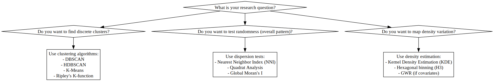

# spatial-cluster-analysis


### **Comparison Table of Methods**

| **Concept**        | **Main Question**                                      | **Common Algorithms / Measures**                | **Typical Tools** |
|---------------------|---------------------------------------------------------|-------------------------------------------------|--------------------|
| **Clustering**      | Are points grouped into discrete clusters?             | DBSCAN, HDBSCAN, K-Means, SKATER, Ripley’s K   | Python: `hdbscan`, `scikit-learn`; QGIS: *Cluster Points*; ArcGIS: *Spatially Constrained Clustering* |
| **Dispersion**       | Is the overall pattern random, clustered, or uniform? | Nearest Neighbor Index (NNI), Quadrat Analysis, Global Moran’s I | Python: `pointpats`, `esda`; QGIS: *Average Nearest Neighbor*; ArcGIS: *Spatial Autocorrelation* |
| **Heterogeneity of Density** | Does intensity vary across space? Continuous variation? | Kernel Density Estimation (KDE), Hexagonal binning (H3), GWR (if covariates) | Python: `h3`, `mgwr`; QGIS: *Heatmap Plugin*, *GWR Plugin*; ArcGIS: *Kernel Density*, *GWR Tool* |

---

### **Are these algorithms essentially the same?**
No—they differ because:
- **Clustering** → Detects discrete groups (unsupervised ML or point pattern functions).
- **Dispersion** → Tests overall spatial randomness vs aggregation.
- **Heterogeneity** → Examines continuous variation in density or intensity.

The **question drives the method**. For example:
- If you want to **find clusters**, use DBSCAN/HDBSCAN.
- If you want to **test randomness**, use NNI or Moran’s I.
- If you want to **map density variation**, use KDE or H3 grids.

## OPTICS Heterogeneity Detections Analysis Notebook
Jupyter notebook for spatial analysis (point process, planar)

- Synthetic spatial data generation (ready to run without external files)
- OPTICS clustering with visualization
- Reachability plot for OPTICS
- DBSCAN comparison
- H3 hexagonal aggregation for density analysis
- Cluster + density overlay visualization

Heterogeneity metrics:

- Variance
- Gini coefficient
- Entropy

## Cluster Analysis — Decision Tree



Notes
- SVG is preferred for crisp diagrams and for embedding into GitHub Pages. If you need raster PNG at a specific pixel size, convert the SVG to PNG with a tool like `rsvg-convert`, `inkscape` or `CairoSVG`.
- The notebook writes the SVG directly using Graphviz (`format='svg'`). If you want interactive or scripted SVG, place the SVG on a GitHub Pages HTML page (raw HTML), as GitHub's README sanitizer may remove embedded scripts in repo Markdown.

This folder contains the Graphviz decision tree used in the project. The notebook `decision_graph.ipynb` renders the diagram and saves two outputs in this folder:

- `spatial_analysis_decision_tree_highres.png` — high-resolution PNG (raster)
- `spatial_analysis_decision_tree.svg` — vector SVG (scales cleanly)

How to include the SVG in Markdown (works on GitHub Pages and in repository README):


Markdown image:

```markdown

```

Or use an HTML img tag to control size:

```html

```
